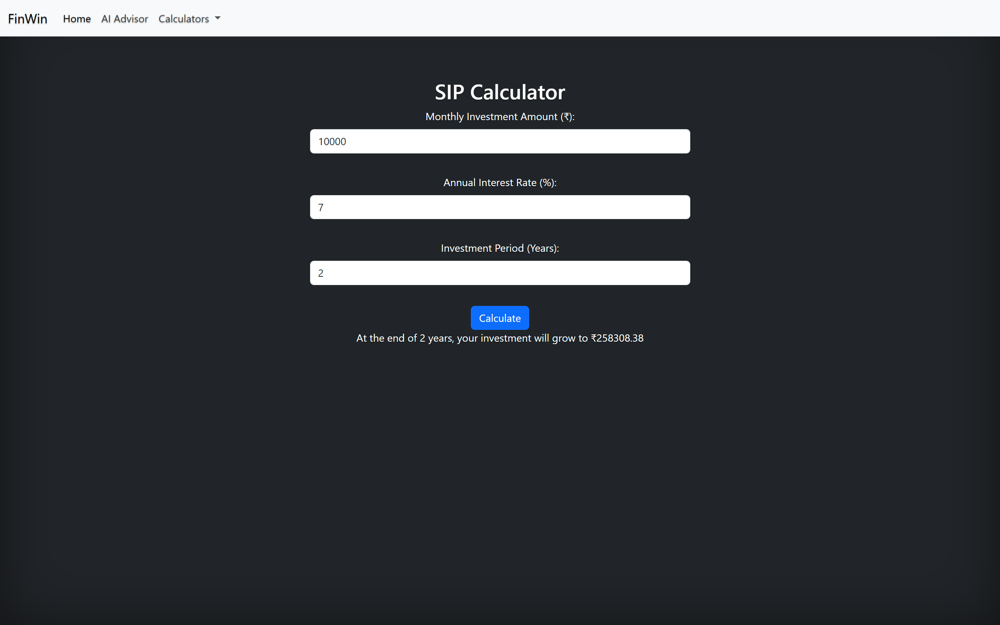
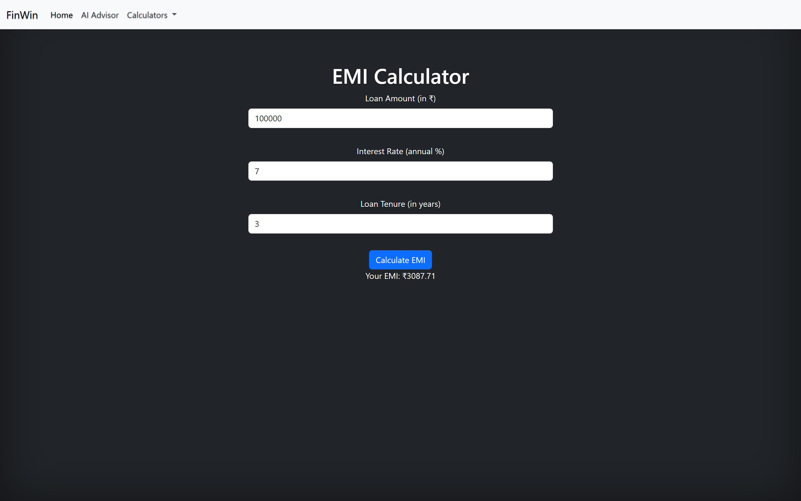

# FinancialAIAdvisor

## Develop a solution to improve financial awareness among people, using visualizations, and providing methods to increase savings.

## Description
We're excited to introduce our new financial empowerment platform! Our chatbot offers personalized financial assessments to help you understand your current situation and discover areas for improvement. Additionally, we've included calculators for EMI, tax, and SIP investments, making financial planning more accessible. Take charge of your finances and pave the way for a secure future with our user-friendly platform!

## Features
- AI Advisor
- SIP calculator
- EMI calculator
- Tax calculator
- User-friendly UI/UX

## Tech Stack
Front-end:
HTML5
CSS with Bootstrap
JavaScript

Chatbot Integration:
Google Gemini API

JavaScript
Calculators (EMI, Tax, SIP):

## Screenshots
Home Page

AI Advisor

AI Advisor Outputs
 

SIP calculator

EMI calculator

Income Tax calculator

## Deployed Url(Currently Not Functional)
[Link to Deployed Solution](https://root2j.github.io/HM0044_Enigma/)

